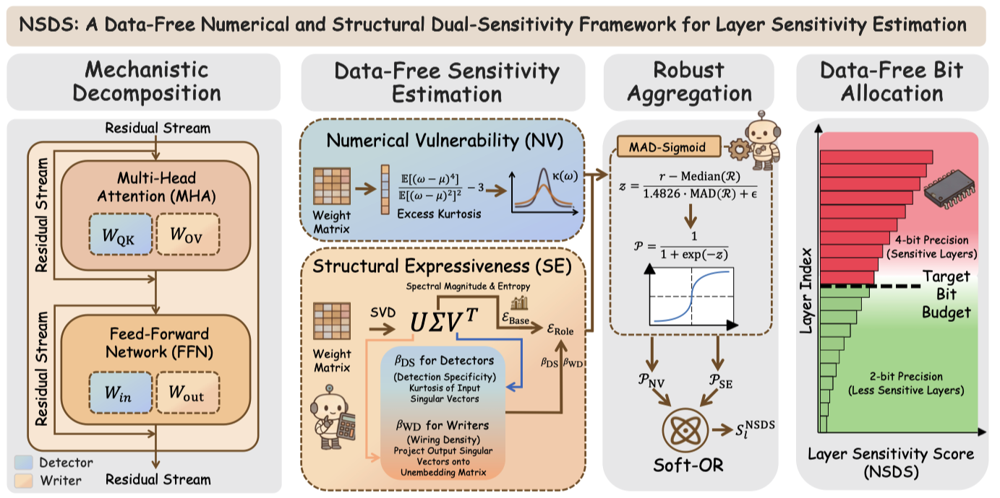

# Beyond Outliers: A Data-Free Layer-wise Mixed-Precision Quantization Approach Driven by Numerical and Structural Dual-Sensitivity

[](https://www.python.org/downloads/)
[](https://pytorch.org/)
[](https://opensource.org/licenses/MIT)

This repository contains the official implementation of the **NSDS** (Numerical and Structural Dual-Sensitivity) framework for data-free layer-wise sensitivity estimation in Large Language Models, as presented in our paper:

> **Beyond Outliers: A Data-Free Layer-wise Mixed-Precision Quantization Approach Driven by Numerical and Structural Dual-Sensitivity**

---

## Overview


Existing calibration-free LMPQ methods suffer from two limitations: (1) they treat all weight modules within a layer uniformly, ignoring their distinct operational roles, and (2) they rely on a single numerical property, overlooking the structural expressiveness of the weights.

**NSDS** addresses both issues by:

1. **Mechanistically decomposing** each layer into *Detectors* (QK-Circuit, Up-projection, Gate-projection) and *Writers* (OV-Circuit, Down-projection) based on mechanistic interpretability principles.
2. **Estimating dual-aspect sensitivity** from two complementary perspectives:
   - **Numerical Vulnerability (NV)**: excess kurtosis of the weight distribution.
   - **Structural Expressiveness (SE)**: spectral magnitude weighted by role-aware reweighting factors (Detection Specificity β_DS for Detectors; Writing Density β_WD for Writers).
3. **Aggregating scores** via MAD-Sigmoid normalization and Soft-OR fusion into a unified per-layer sensitivity metric.

---

## Repository Structure

```
nsds-lmpq/
├── main.py                  # Unified entry point for all metrics
├── requirements.txt
├── metrics/
│   ├── nsds.py              # NSDS (proposed)
│   ├── zd.py                # ZD baseline
│   ├── mse.py               # MSE baseline
│   ├── ewq.py               # EWQ baseline
│   ├── lim.py               # LIM baseline
│   ├── llm_mq.py            # LLM-MQ baseline
│   ├── lsaq.py              # LSAQ baseline
│   ├── lieq.py              # LieQ baseline
│   └── kurtboost.py         # KurtBoost baseline
├── utils/
│   ├── model_utils.py       # Model loading & architecture helpers
│   └── data_utils.py        # Calibration data utilities
├── scripts/
│   ├── run_nsds.sh          # Run NSDS on a single model
│   ├── run_baseline.sh      # Run a single baseline metric
│   └── run_all.sh           # Run all metrics sequentially
└── results/                 # Output JSON files
```

---

## Installation

```bash
git clone https://github.com/your-org/nsds-lmpq.git
cd nsds-lmpq
pip install -r requirements.txt
```

---

## Quick Start

### Run NSDS (data-free, proposed method)

```bash
python main.py \
    --model_path  meta-llama/Llama-3.1-8B \
    --metric      nsds \
    --output_dir  results/
```

### Run a baseline

```bash
python main.py \
    --model_path  meta-llama/Llama-3.1-8B \
    --metric      zd \
    --output_dir  results/
```

### Run all metrics

```bash
bash scripts/run_all.sh  meta-llama/Llama-3.1-8B  results/  cuda:0  128
```

---

## Command-Line Arguments

| Argument | Default | Description |
|---|---|---|
| `--model_path` | *(required)* | HuggingFace model ID or local path |
| `--metric` | *(required)* | Metric name: `nsds`, `zd`, `mse`, `ewq`, `lim`, `llm_mq`, `lsaq`, `lieq`, `kurtboost` |
| `--output_dir` | `results` | Directory to write JSON output |
| `--num_bits` | `2` | Quantization bit-width (for MSE / LLM-MQ) |
| `--num_samples` | `128` | Calibration samples (for data-dependent metrics) |
| `--batch_size` | `8` | Batch size for calibration forward passes |
| `--max_length` | `2048` | Maximum token sequence length |
| `--device` | `cuda:0` | Device string |
| `--avg_bit_budget` | `3.0` | Average bit budget for LLM-MQ allocation |

---

## Metrics Summary

| Metric | Type | Description |
|---|---|---|
| **NSDS** | Data-free | Numerical & Structural Dual-Sensitivity (proposed) |
| ZD | Data-free | Z-score Distribution outlier fraction |
| MSE | Data-free | Quantization mean squared error sensitivity |
| EWQ | Data-free | Entropy-Weighted Quantization layer entropy |
| KurtBoost | Data-free | Kurtosis-based weight distribution analysis |
| LieQ | Data-free | Differential representational compactness |
| LIM | Calibration | Layer Importance Metric via block cosine similarity |
| LSAQ | Calibration | Jaccard-based semantic transformation score |
| LLM-MQ | Calibration | First-order Taylor sensitivity with ILP bit allocation |

---

## Output Format

Each metric saves a JSON file under `results/`:

```json
{
  "metric": "nsds",
  "model": "Llama-3.1-8B-Instruct",
  "num_layers": 32,
  "layer_scores": {
    "layer_0": 0.423,
    "layer_1": 0.187,
    ...
  },
  "ranked_layers": [5, 12, 0, ...],
  "scores": [0.423, 0.187, ...]
}
```

The `ranked_layers` field lists layer indices sorted from most sensitive to least sensitive, and can be directly used for bit-width allocation (assign 4-bit to top-ranked layers).

---

## Supported Model Families

The codebase is tested on:

- **LLaMA** family (Llama-3.1-8B, Llama-2-13B)
- **Qwen** family (Qwen2.5-7B, Qwen2.5-14B)


Any model with standard `AutoModelForCausalLM` support should work out of the box.


